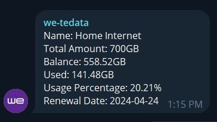

## we-toolkit-telegram
Get info from WE Telecom Egypt api and sent it via Telegram

## Requirement
Node v18.20.0

v20.12.0 is not recommend

## Installation

`git clone`

`npm install`

## Usage

1. Change WE_LOGIN_NUMBER and WE_LOGIN_PASSWORD in run.js
2. Get telegram bot api token from telegram @BotFather
3. Get chat id by using `https://api.telegram.org/bot<YourBOTToken>/getUpdates`
4. Run the script `node run.js`

## Example response

## Acknowledgements

- we-toolkit from [kofta999](https://github.com/kofta999)